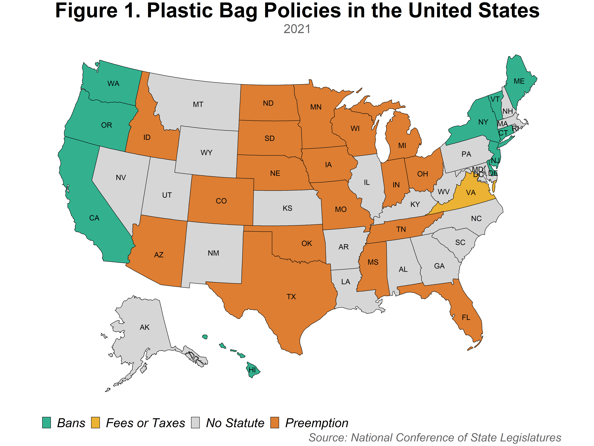
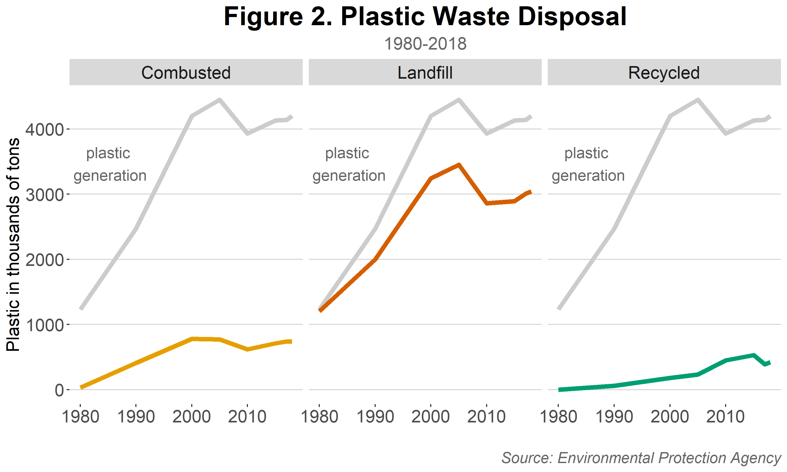
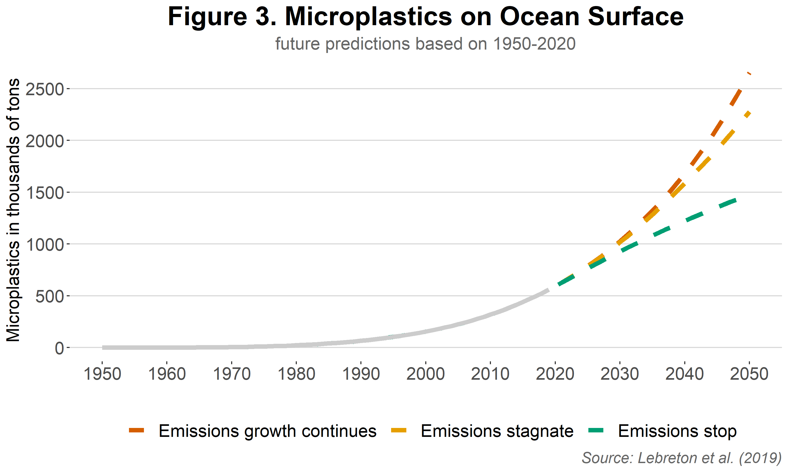
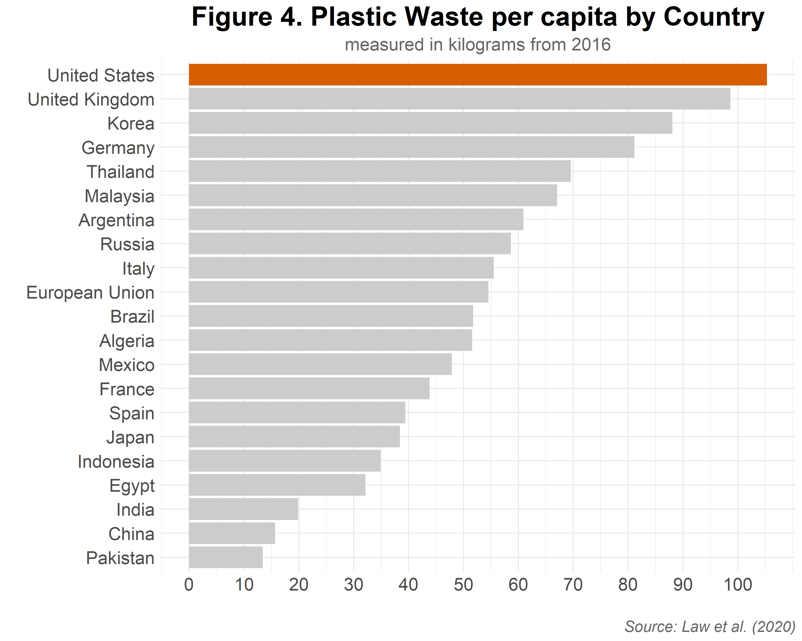
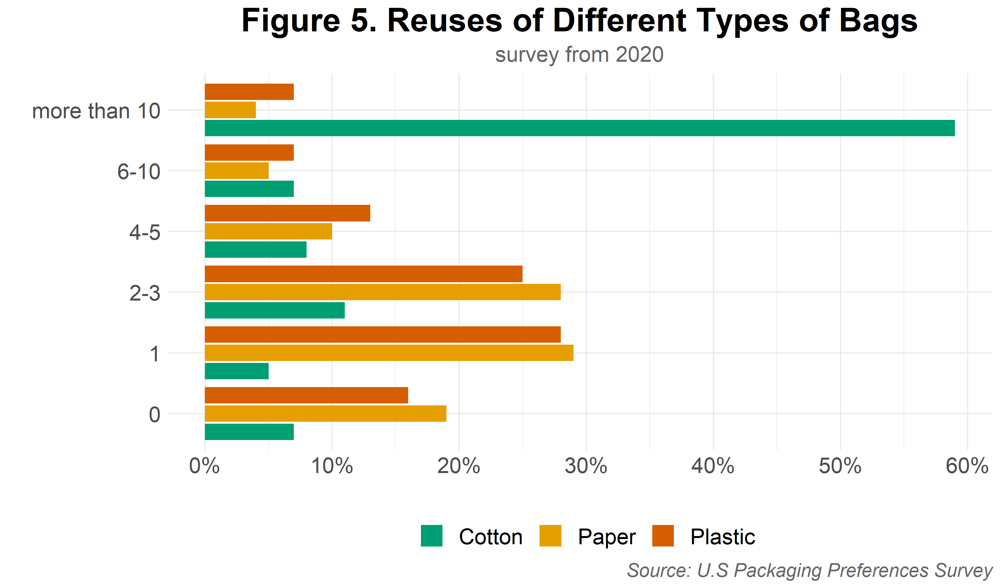

# Plastic Waste in the United States of America

Between 1980 and 2018 plastic generation has risen drastically, leaving behind a large carbon footprint and a large quantity of mismanaged waste. This project focuses on the need for plastic waste regulation and illustrates this in the following data visualizations.

Note: color pallete chosen with colorblind accessibility in mind.

## Visualizations

The following map compares state plastic bag regulation in the United States in 2021.

Over time, most plastic is dumped in a landfill while extraordinarily little is recycled or combusted for energy recovery.

Microplastics found at the surface of the ocean have steadily increased between 1950 and 2020 and will continue increasing in the future according to future forcasts.

When comparing different countries, the United States of America had the highest plastic waste per capita in 2016.

Americans are more likely to reuse cotton bags than paper or plastic bags according to the 2020 U.S. Packaging Preference Survey.

## References

Law, K., Starr, N., Siegler, T., Jambeck, J., Mallos, N., & Leonard, G. (2020, October 01). *The United States' contribution of plastic waste to land and ocean*. Retrieved from [https://advances.sciencemag.org/content/6/44/eabd0288/tab-figures-data](https://advances.sciencemag.org/content/6/44/eabd0288/tab-figures-data).

Lebreton, L., Egger, M. & Slat, B. *A global mass budget for positively buoyant macroplastic debris in the ocean*. Sci Rep 9, 12922 (2019). [https://doi.org/10.1038/s41598-019-49413-5](https://doi.org/10.1038/s41598-019-49413-5).

National Conference of State Legislatures (2021, February 8). *State plastic bag legislation*. Retrieved from [https://www.ncsl.org/research/environment-and-natural-resources/plastic-bag-legislation.aspx](https://www.ncsl.org/research/environment-and-natural-resources/plastic-bag-legislation.aspx).

Toluna. (2020). *U.S. Packaging Preferences 2020*. Retrieved from [https://twosidesna.org/packaging2020/](https://twosidesna.org/packaging2020/).

United States Environmental Protection Agency. (2020). *Advancing Sustainable Materials Management: 2018 Tables and Figures*. Retrieved from [https://www.epa.gov/sites/production/files/2021-01/documents/2018_tables_and_figures_dec_2020_fnl_508.pdf](https://www.epa.gov/sites/production/files/2021-01/documents/2018_tables_and_figures_dec_2020_fnl_508.pdf).
